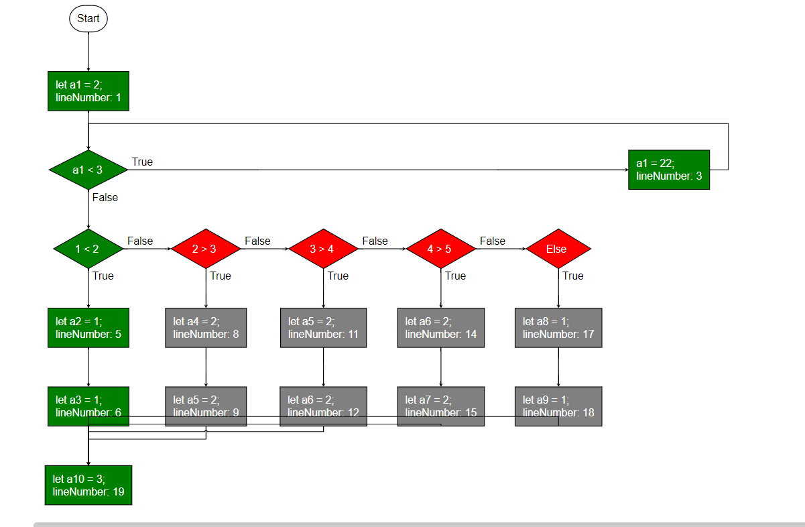

example of running the next input:
let a1 = 2;

while(a1 < 3){
  a1 = 22;
}

if(1 < 2){
    let a2 = 1;
    let a3 = 1;
} else if(2 > 3) {
    let a4 = 2;
    let a5 = 2;
} else if(3 > 4) {
    let a5 = 2;
    let a6 = 2;
} else if(4 > 5) {
    let a6 = 2;
    let a7 = 2;
} else {
    let a8 = 1;
    let a9 = 1;
}

let a10 = 3;